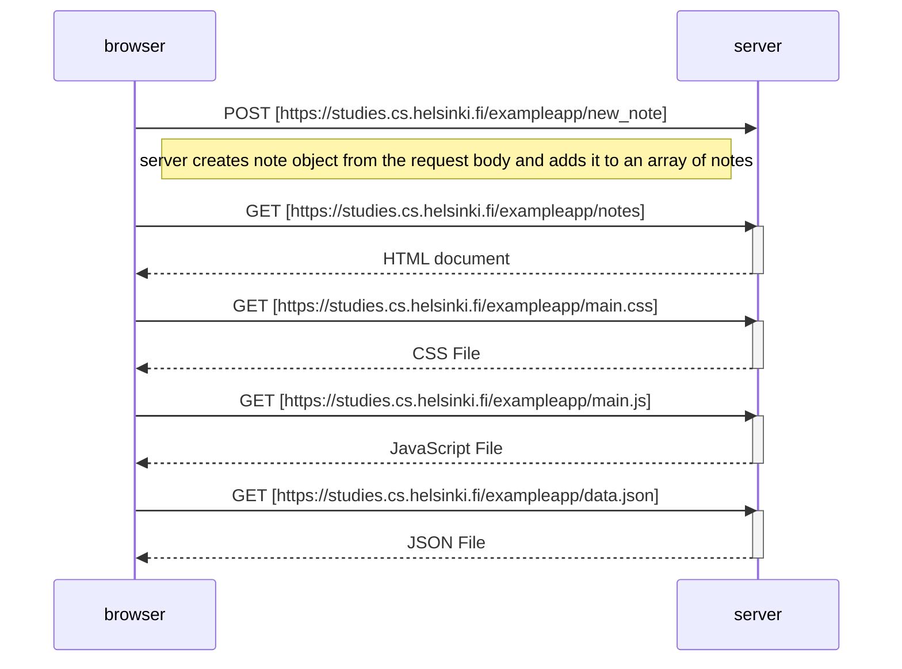

```mermaid
sequenceDiagram
    participant browser
    participant server
 browser->>server: POST [https://studies.cs.helsinki.fi/exampleapp/new_note]
 Note right of browser: server creates note object from the request body and adds it to an array of notes
 browser->>server: GET [https://studies.cs.helsinki.fi/exampleapp/notes]
    activate server
    server-->>browser: HTML document
    deactivate server
 browser->>server: GET [https://studies.cs.helsinki.fi/exampleapp/main.css]
    activate server
    server-->>browser: CSS File
    deactivate server
 browser->>server: GET [https://studies.cs.helsinki.fi/exampleapp/main.js]
    activate server
    server-->>browser: JavaScript File
    deactivate server
 browser->>server: GET [https://studies.cs.helsinki.fi/exampleapp/data.json]
    activate server
    server-->>browser: JSON File
    deactivate server
```
